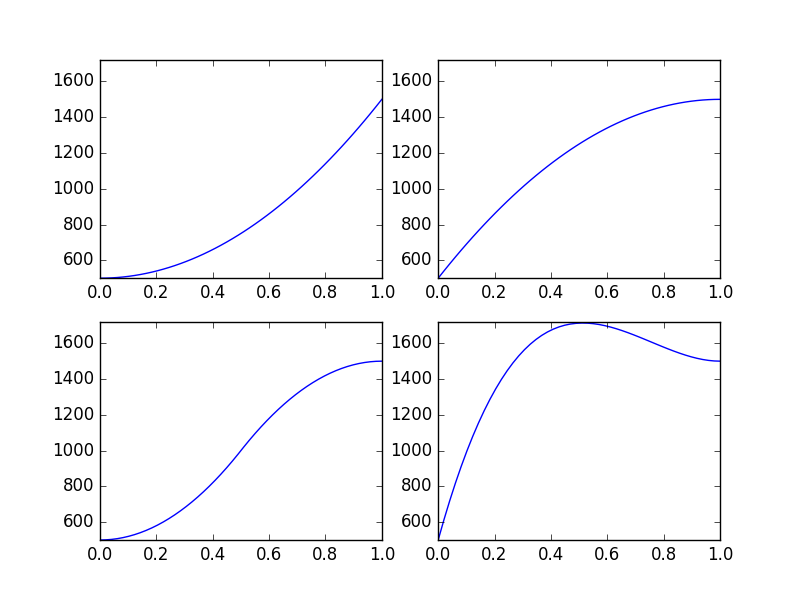

# nmap

Map a number from one range to another

```python
>>> from nmap import nmap
>>> mapfn = nmap(0, 100, 500, 1000)
>>> mapfn(0)
500.0
>>> mapfn(50)
750.0
>>> mapfn(100)
1000.0
```

Example using the `normfn` argument to cast output to int

```python
>>> from nmap import nmap
>>> mapfn = nmap(500, 1000, 1, 10, normfn=int)
>>> mapfn(500)
1
>>> mapfn(750)
5
>>> mapfn(1000)
10
```

Example using easing functions as `curvefn`

```python
import matplotlib.pyplot as plt
import numpy as np
import math

from ease import *
from nmap import nmap

x = np.linspace(0, 1)
yaxis = (np.linspace(0, 0), np.linspace(-10, 10))
easefns = [cubic_in, cubic_out, cubic_in_out, out_back]
fns = [nmap(0, 1, 500, 1500, fn) for fn in easefns]
size = math.ceil(math.sqrt(len(fns)))
size = size * 100 + size * 10

for i, fn in enumerate(fns):
    plt.subplot(size + i + 1)
    plt.plot(*yaxis, 'black')
    plt.plot(*reversed(yaxis), 'black')
    plt.plot(x, np.array([fn(xn) for xn in x]))
    plt.axis([0, 1, 500, 1720])

plt.show()
```


